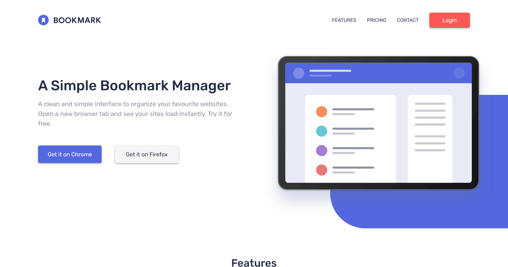

<h1 align="center">Bookmark landing page
</h1>

<div align="center">
   Solution for a challenge from  <a href="https://www.frontendmentor.io/" target="_blank">Frontend Mentor</a>.
</div>

<div align="center">
  <h3>
    <a href="https://landing-page-gray.vercel.app/">
      Demo
    </a>
    <span> | </span>
    <a href="https://www.frontendmentor.io/solutions/landing-page-using-pug-sass-js-Ib1CExmJP">
      Solution
    </a>
    <span> | </span>
    <a href="https://www.frontendmentor.io/challenges/bookmark-landing-page-5d0b588a9edda32581d29158">
      Challenge
    </a>
  </h3>
</div>

<!-- TABLE OF CONTENTS -->

## Table of Contents

- [Overview](#overview)
  - [Built With](#built-with)
- [How to use](#how-to-use)
- [Contact](#contact)

<!-- OVERVIEW -->

## Overview



This is a responsive landing page hosted on [Vercel](https://vercel.com/) with several sections and some interactive elements.

### Built With

- [Pug](https://pugjs.org/)
- [Sass](https://sass-lang.com/)

## How To Use

<!-- Example: -->

To clone and run this application, you'll need [Git](https://git-scm.com), [Node.js](https://nodejs.org/en/download/) (npm), [Gulp](https://gulpjs.com/docs/en/getting-started/quick-start/) and [Babel](https://babeljs.io/docs/en/babel-cli) installed on your computer. From your command line:

```bash
# Clone this repository
$ git clone https://github.com/BrandonSdvl/LandingPage.git

# Install dependencies
$ npm install

# Run server
$ gulp
```

## Contact

- GitHub [@BrandonSdvl](https://github.com/BrandonSdvl)
